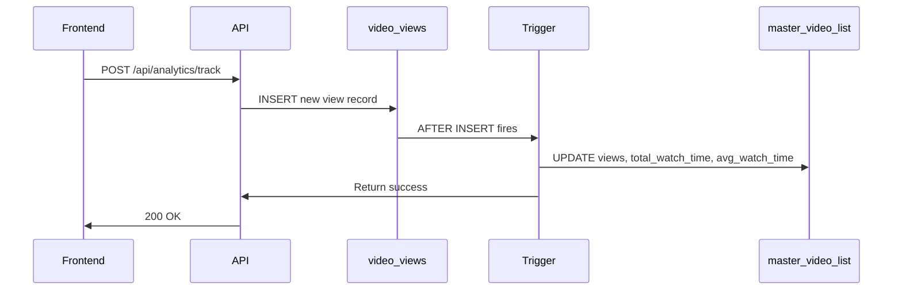

# View Count Synchronization

## Overview
This document explains how we synchronize view counts between our detailed `video_views` analytics table and the legacy `master_video_list.views` column.

## Problem Statement

We have **two view tracking systems**:

1. **`master_video_list.views`** (Legacy)
   - Simple integer counter
   - Updated from Bunny.net API during sync
   - Used by older analytics queries
   - Static, external source

2. **`video_views` table** (New Analytics BRAID)
   - Detailed event tracking
   - Tracks user_id, session_id, duration, percentage
   - Powers trending, engagement, revenue attribution
   - Our source of truth

**The Issue**: These two systems were **not synced**, leading to inconsistent data.

## Solution Architecture

### Automatic Synchronization via Database Trigger

We use a PostgreSQL trigger to automatically sync `master_video_list.views` whenever a new view is recorded:

```sql
CREATE TRIGGER trigger_sync_master_video_views
    AFTER INSERT ON video_views
    FOR EACH ROW
    EXECUTE FUNCTION update_master_video_views();
```

### What Gets Synced

The trigger updates **three columns** in `master_video_list`:

1. **`views`**: Count of unique viewers (distinct user_id or session_id)
2. **`total_watch_time`**: Sum of all watched duration in seconds
3. **`average_watch_time`**: Average watched duration per view

### Unique View Logic

A "unique view" is counted as a distinct combination of:
- **Authenticated users**: `user_id` (if logged in)
- **Anonymous users**: `session_id` (if not logged in)

```sql
COUNT(DISTINCT COALESCE(user_id::text, session_id))
```

This means:
- Same user watching 10 times = **1 unique view**
- Same anonymous session watching 5 times = **1 unique view**
- 10 different users = **10 unique views**

## Implementation Details

### Migration 062

File: `backend/migrations/062_sync_master_video_views.sql`

**Steps**:
1. Creates `update_master_video_views()` function
2. Creates trigger on `video_views` table
3. Backfills historical data from existing `video_views`
4. Creates performance index
5. Adds documentation comments

### Trigger Function Logic

```sql
CREATE OR REPLACE FUNCTION update_master_video_views()
RETURNS TRIGGER AS $$
BEGIN
    UPDATE master_video_list
    SET 
        views = (
            SELECT COUNT(DISTINCT COALESCE(user_id::text, session_id))
            FROM video_views
            WHERE video_id = NEW.video_id
        ),
        total_watch_time = (
            SELECT COALESCE(SUM(watched_duration), 0)
            FROM video_views
            WHERE video_id = NEW.video_id
        ),
        average_watch_time = (
            SELECT COALESCE(AVG(watched_duration), 0)::integer
            FROM video_views
            WHERE video_id = NEW.video_id
        ),
        updated_at = CURRENT_TIMESTAMP
    WHERE id = NEW.video_id;
    
    RETURN NEW;
END;
$$ LANGUAGE plpgsql;
```

### Performance Considerations

**Index Added**:
```sql
CREATE INDEX idx_video_views_video_user_session 
    ON video_views(video_id, user_id, session_id);
```

This index speeds up:
- Unique view counting
- Aggregation queries
- Trigger execution

**Trigger Cost**:
- Executes on every `INSERT` to `video_views`
- Runs 3 aggregation queries per video view
- Acceptable overhead for data consistency

**Optimization**: If performance becomes an issue, we can:
- Batch sync every N minutes instead of real-time
- Use materialized views
- Cache aggregated counts

## Data Flow

### Recording a View



### Flow Steps

1. **Frontend** tracks video view (user watches ≥3 seconds)
2. **API** receives tracking request
3. **`RecordView()`** inserts row into `video_views`
4. **Trigger** automatically fires after insert
5. **Trigger function** aggregates all views for that video
6. **`master_video_list`** updated with fresh counts
7. **Both systems** now have consistent data

## Backfill Strategy

### Initial Sync

The migration includes a backfill query to sync existing data:

```sql
UPDATE master_video_list mvl
SET 
    views = COALESCE(view_counts.unique_views, 0),
    total_watch_time = COALESCE(view_counts.total_watch_time, 0),
    average_watch_time = COALESCE(view_counts.avg_watch_time, 0),
    updated_at = CURRENT_TIMESTAMP
FROM (
    SELECT 
        video_id,
        COUNT(DISTINCT COALESCE(user_id::text, session_id)) as unique_views,
        SUM(watched_duration) as total_watch_time,
        AVG(watched_duration)::integer as avg_watch_time
    FROM video_views
    GROUP BY video_id
) view_counts
WHERE mvl.id = view_counts.video_id;
```

### Manual Resync (if needed)

If you need to manually resync all videos:

```sql
-- Run this query to force a full resync
UPDATE master_video_list mvl
SET 
    views = COALESCE(view_counts.unique_views, 0),
    total_watch_time = COALESCE(view_counts.total_watch_time, 0),
    average_watch_time = COALESCE(view_counts.avg_watch_time, 0),
    updated_at = CURRENT_TIMESTAMP
FROM (
    SELECT 
        video_id,
        COUNT(DISTINCT COALESCE(user_id::text, session_id)) as unique_views,
        SUM(watched_duration) as total_watch_time,
        AVG(watched_duration)::integer as avg_watch_time
    FROM video_views
    GROUP BY video_id
) view_counts
WHERE mvl.id = view_counts.video_id;
```

## Bunny.net Conflict Resolution

### Potential Issue

`master_video_list.views` can be updated from **two sources**:
1. **Our trigger** (from `video_views`)
2. **Bunny.net sync** (from external API)

### Resolution Strategy

**Our data wins**. Here's why:

1. **Bunny.net views** are from their CDN analytics
2. **Our views** are from actual user tracking in our app
3. **Our views** are more accurate for revenue attribution
4. **Our views** include detailed engagement data

### Handling Bunny Sync

In `backend/internal/routes/routes.go`, line 973-975:

```go
if dbVideo.ViewCount != bunnyVideo.Views {
    updates["view_count"] = bunnyVideo.Views
}
```

**Recommendation**: Modify this to **not overwrite** if we have `video_views` data:

```go
// Check if we have detailed analytics
hasDetailedAnalytics, _ := db.HasVideoViews(dbVideo.ID)
if !hasDetailedAnalytics && dbVideo.ViewCount != bunnyVideo.Views {
    updates["view_count"] = bunnyVideo.Views
}
```

This ensures:
- **New videos**: Get Bunny.net view count until first tracked view
- **Tracked videos**: Our analytics data is authoritative
- **No conflicts**: Once we track a video, we own the count

## Verification Queries

### Check Sync Status

```sql
-- Compare view counts between systems
SELECT 
    mvl.id,
    mvl.title,
    mvl.views as master_views,
    COUNT(DISTINCT COALESCE(vv.user_id::text, vv.session_id)) as analytics_views,
    mvl.views - COUNT(DISTINCT COALESCE(vv.user_id::text, vv.session_id)) as difference
FROM master_video_list mvl
LEFT JOIN video_views vv ON vv.video_id = mvl.id
GROUP BY mvl.id, mvl.title, mvl.views
HAVING mvl.views != COUNT(DISTINCT COALESCE(vv.user_id::text, vv.session_id))
ORDER BY ABS(mvl.views - COUNT(DISTINCT COALESCE(vv.user_id::text, vv.session_id))) DESC;
```

### Verify Trigger is Active

```sql
-- Check trigger exists
SELECT 
    trigger_name,
    event_manipulation,
    event_object_table,
    action_statement
FROM information_schema.triggers
WHERE trigger_name = 'trigger_sync_master_video_views';
```

### Test Trigger Manually

```sql
-- Insert a test view (replace with real video_id)
INSERT INTO video_views (
    video_id, session_id, watched_duration, watched_percentage, created_at
) VALUES (
    1, 'test-session-' || gen_random_uuid(), 120, 75.5, NOW()
);

-- Verify master_video_list was updated
SELECT views, total_watch_time, average_watch_time, updated_at
FROM master_video_list
WHERE id = 1;
```

## Benefits

### Consistency
- Single source of truth for view counts
- No data discrepancies between systems
- Reliable metrics for dashboards

### Backwards Compatibility
- Legacy code reading `master_video_list.views` still works
- No need to update old queries immediately
- Gradual migration to new analytics

### Accuracy
- Unique view counting (not just total requests)
- Real user engagement data
- Better for revenue attribution

### Performance
- Indexed queries
- Efficient trigger function
- Minimal overhead

## Future Improvements

### Potential Enhancements

1. **Batch Sync**: Update every 5 minutes instead of real-time
   - Reduces trigger overhead
   - Still maintains near real-time accuracy

2. **Materialized View**: Create a materialized view for aggregates
   - Pre-computed counts
   - Refresh on schedule
   - Faster queries

3. **Incremental Updates**: Track delta instead of full recalculation
   - Store last count
   - Only add new views
   - More efficient for high-traffic videos

4. **Conflict Logging**: Log when Bunny.net tries to overwrite
   - Audit trail
   - Identify discrepancies
   - Debug sync issues

## Monitoring

### Metrics to Track

- **Sync latency**: Time from view insert to master update
- **Discrepancies**: Differences between systems
- **Trigger failures**: Errors in sync function
- **Backfill runs**: Manual resync operations

### Alerts

Set up alerts for:
- Trigger disabled or missing
- Large discrepancies (>10% difference)
- Sync function errors
- Performance degradation

## Rollback Plan

If issues arise with the trigger:

```sql
-- Disable trigger temporarily
DROP TRIGGER IF EXISTS trigger_sync_master_video_views ON video_views;

-- Re-enable when ready
CREATE TRIGGER trigger_sync_master_video_views
    AFTER INSERT ON video_views
    FOR EACH ROW
    EXECUTE FUNCTION update_master_video_views();
```

## Conclusion

The view count synchronization ensures data consistency between our legacy `master_video_list.views` column and our new detailed `video_views` analytics table. The automatic trigger-based approach provides:

- **Real-time sync** on every view
- **Accurate counts** using unique viewer logic
- **Backward compatibility** with existing code
- **Low overhead** with proper indexing

This sync is a critical component of our Video Analytics BRAID and ensures reliable metrics for trending, top videos, and revenue attribution features.

